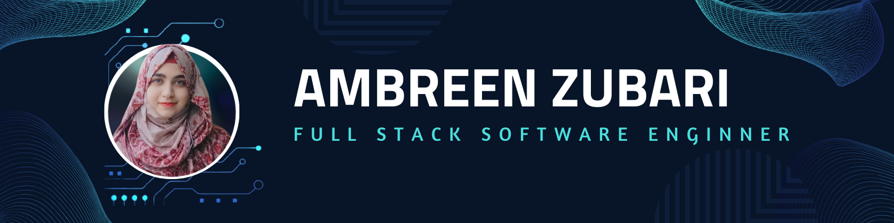

<h1 align="center">Hi 👋, I'm Ambreen Zubari</h1>
<h3 align="center">🚀 Full-Stack Software Engineer | 💡 Problem Solver | 🌟 Passionate Coder</h3>

  

---

### 👩‍💻 **About Me**
- 🔥 Passionate Full-Stack Developer dedicated to crafting exceptional web and mobile applications! 🚀- 💻 Expert in **Angular**, **React**, **Ionic**, **Node.js**, **Next.js**, and **.NET**.
- ☁️ Skilled in **Azure**, **Firebase**, **WebRTC**, **Zoom API**, **Twilio**, and more.
- 🌍 I deliver **scalable, user-friendly, and secure solutions** for various industries like **e-commerce**, **healthcare**, and **event management**.
- 🎓 Holder of a **Bachelor's in Computer Science**.
- 🌟 Proficient in **Figma-to-code workflows**, translating UI/UX designs into fully functional apps.
- 📚 Lifelong learner exploring **microservices**, **real-time systems**, and **AI-driven solutions**.

---

### 🛠️ **Tech Stack**

  
  
  
  
  
  
  

---

  
   
  
   
  

---

### 🏆 **Achievements**

  

---

### ✨ **Client Testimonials**
> "Ambreen delivers high-quality, scalable, and professional solutions. She's an excellent problem solver with great attention to detail."  
> – *Happy Client*

---

### 📬 **Contact Me**

  
  
  

---

### 💡 **Quote to Inspire**
> _“The best way to predict the future is to invent it.”_ – *Alan Kay*

  

